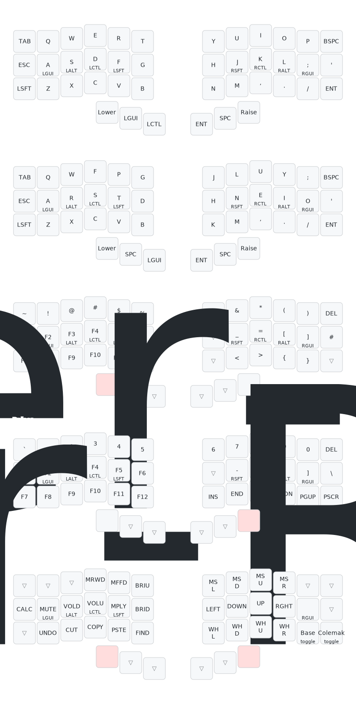

# qmk-piantor

## Render keymap

Requires [qmk](https://docs.qmk.fm/) and [`keymap-drawer`](https://github.com/caksoylar/keymap-drawer).

```sh
keymap parse --layer-names Base Colemak Lower Raise Lower-Raise -q beekeeb_piantor_ohnopiano.json | keymap draw - > beekeeb_piantor_ohnopiano.svg
```



